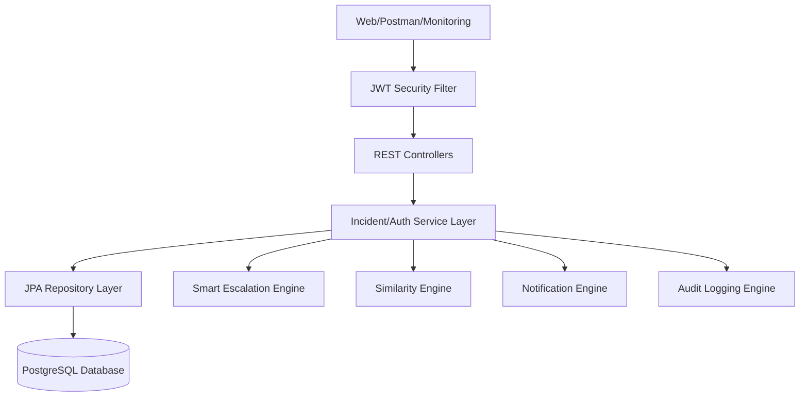
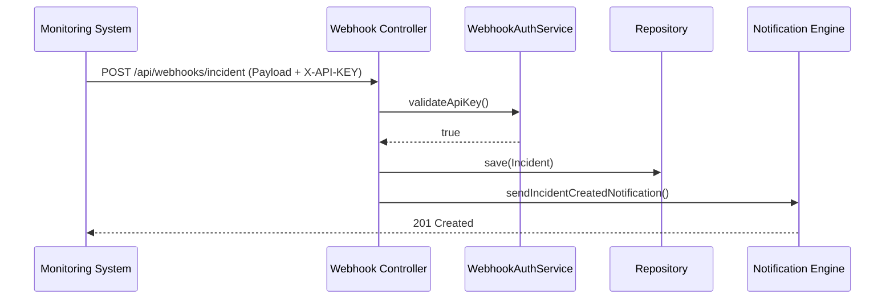

# Zenetrix — Multi-Tenant Intelligent Incident Management Platform

Zenetrix is an enterprise-grade SaaS operations platform inspired by tools like ServiceNow and Jira. It goes beyond basic issue tracking by integrating predictive intelligence, automated SLA escalations, cross-organization multi-tenancy, and event-driven webhook ingestion.

---

## 🚀 Key Features

*   **Multi-Tenant SaaS Architecture**: Scalable environment with isolated tenant data. A single platform serving multiple independent organizations.
*   **Intelligent Similarity Engine**: Uses **Jaccard Similarity** and text tokenization to instantly detect duplicate incidents and link past resolutions.
*   **Smart SLA Escalation Engine**: Proactively scheduled background tasks (`@Scheduled`) to monitor breach thresholds (e.g., auto-escalating issues open > 24 hours).
*   **Event-Driven Webhooks**: Secure `X-API-KEY` webhook endpoints allowing external monitoring tools to auto-create incidents.
*   **Enterprise Audit Logging**: Granular tracking (`IncidentHistory`) mapping exactly who changed what, when, and from which status.
*   **Notification Engine**: Automated Spring Mail integration for triggering alerts on incident creation, resolution, and escalation.
*   **Robust Security**: Fully authenticated APIs using stateless **JWT** (JSON Web Tokens) combined with Spring Security and Role-Based Access Control (RBAC).
*   **Optimized & Scalable REST API**: Includes pagination and dynamic sorting (`Pageable`) to handle high-volume data retrieval.

---

## 🏗️ Architecture Overview

The system is built on a standard enterprise layer architecture with specialized workflow engines.



### Incident Creation Webhook Flow



---

## 🛠️ Technology Stack

*   **Java 17 & Spring Boot 3.2**
*   **Spring Security & JWT**
*   **Spring Data JPA & Hibernate**
*   **PostgreSQL (Supabase)**
*   **Lombok & Spring Mail**
*   **Docker & Docker Compose**

---

## ⚙️ Local Setup & Dockerization

The project is fully dockerized using a multi-stage Docker build for rapid deployment.

1.  **Clone the Repository**
2.  **Configure Environment Variables**:
    Create a `.env` file based on the provided `.env.example`:
    ```bash
    cp .env.example .env
    ```
3.  **Run with Docker Compose**:
    ```bash
    docker-compose up --build -d
    ```
    *This spins up both the Zenetrix Backend application and a local PostgreSQL container.*

---

## 📖 API Documentation (Swagger)

Interactive API documentation is generated automatically.
Once the application is running, navigate to:
`http://localhost:8080/swagger-ui.html`

*(Placeholder for Swagger UI Screenshot)*
``

---

## 📈 Future Enhancements
*   Add predictive business impact estimation using statistical data trends.
*   Integrate Slack and Microsoft Teams notification targets via outgoing webhooks.
*   Implement container orchestration with Kubernetes for auto-scaling.
